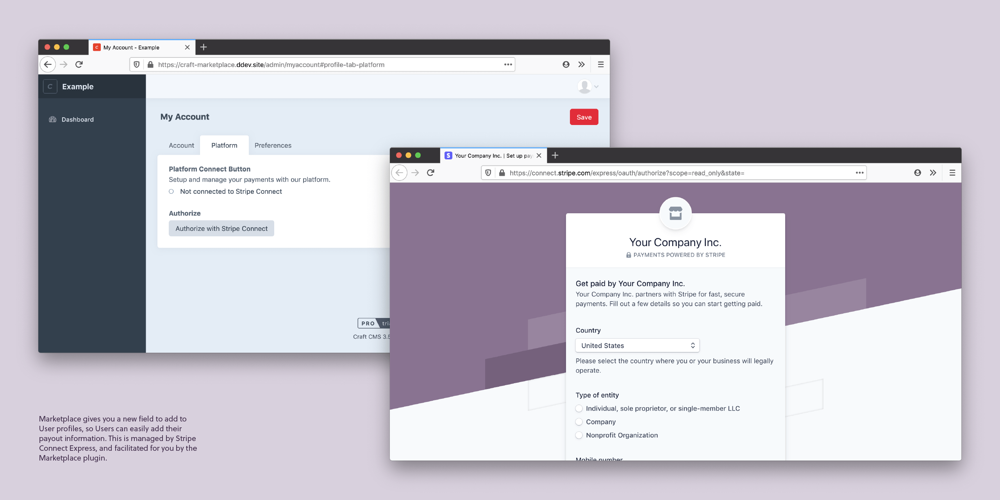

# Marketplace for Craft Commerce

Make your Craft ecommerce site into a Marketplace: add payees to products, charge a fee for your platform, and handle payouts automatically via Stripe Connect.

[Marketplace for Craft Commerce now available!](https://plugins.craftcms.com/marketplace)

## Features

- For Craft Commerce
- For Stripe Payment Gateway
- Set Users as Payees on Products
- Charge a flat or percent Fee
- Automatically split payments

## Resources

- [Documentation](https://craft-marketplace.kennethormandy.com/docs/)
- [Build a marketplace using Craft CMS tutorial](https://craft-marketplace.kennethormandy.com/docs/tutorial)

<!--

# Promo image captions

Add Marketplace Buttons to User profiles, so Users or User Groups that you want to be paid out by your platform can up their payment information. This is managed by Stripe Connect Express, and facilitated for you by the Marketplace plugin.

Users who you want to become Payees will be walked through the Stripe on boarding process, when the click the connection button. Once their account is authorized, this will show in their Craft CMS profile, and in your Stripe Dashboard.

Here, a User has connected their account with Stripe, and you’ve indicated they should be paid for a $10 Craft Commerce product, with your platform taking a $1.23 fee (incl. Stripe’s standard fee you’d pay on any transaction).

Once a User has successfully set up their connection to your platform via Stripe, they will be able to open a minimal Stripe Dashboard to revise their account information, see their payout schedule, etc.

Marketplace gives you another new field to set Payees on Craft Commerce Products (and Digital Products). Indicate that a certain User should be paid out when a Customer purchases that Product.

Configure flat-rate or percentage fees for your platform to make, out of the transaction total.

If it makes sense for your platform, optionally display Payee information to your Customers. There is a full demo of setting this entire flow up with the default Craft Commerce Lite template included in the Marketplace documentation. The only code necessary is if you want to modify your Twig templates.

-->
