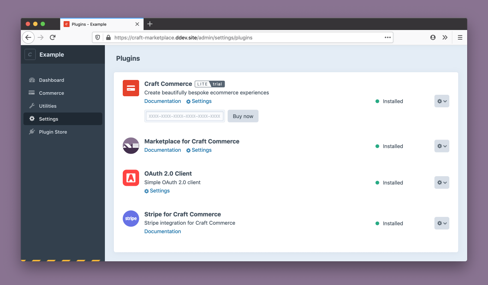
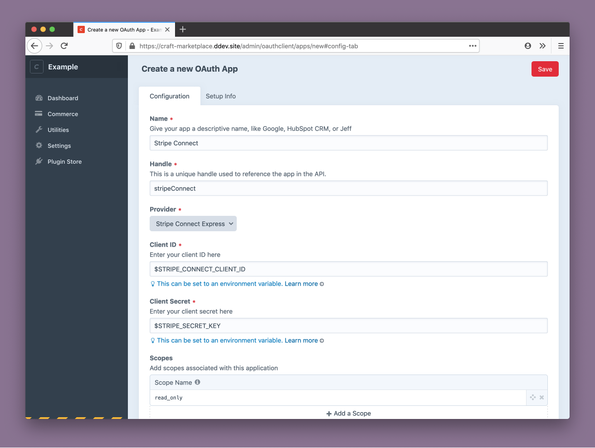
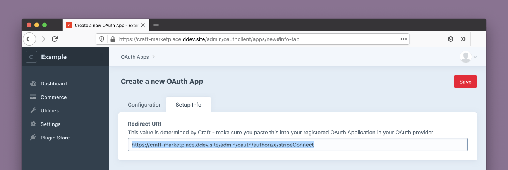
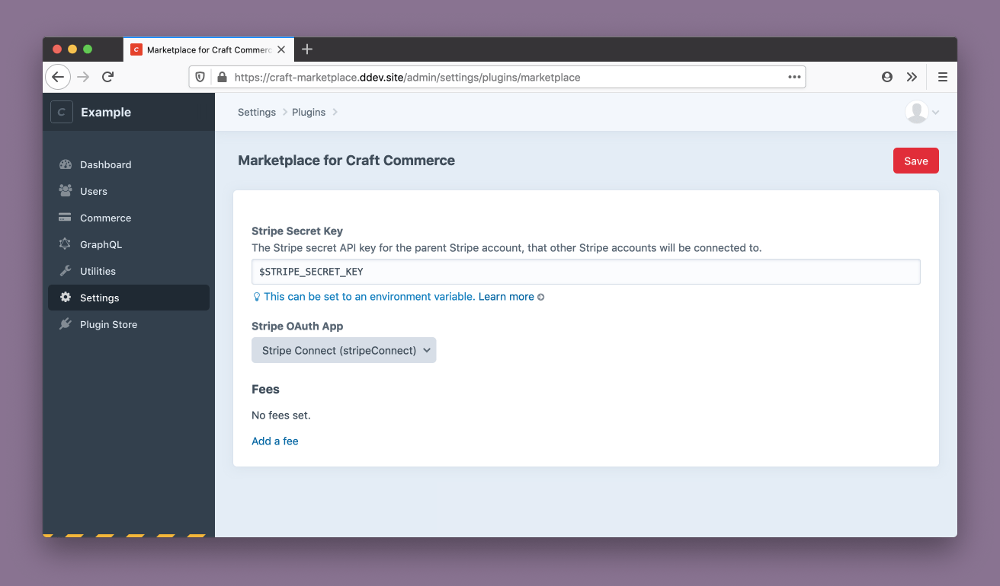
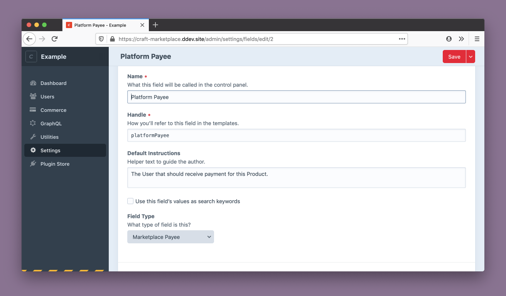
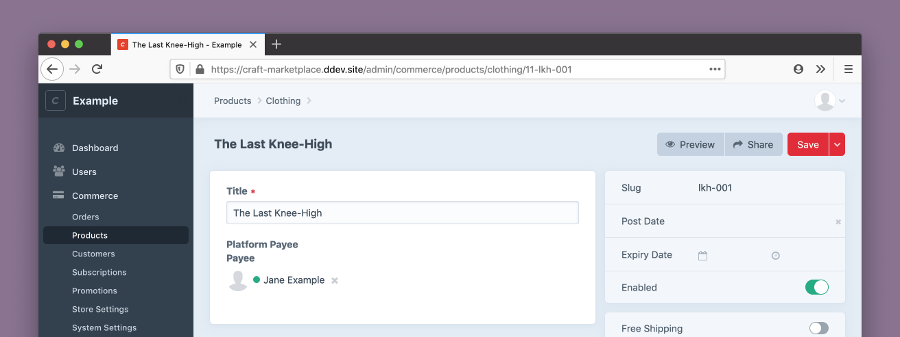
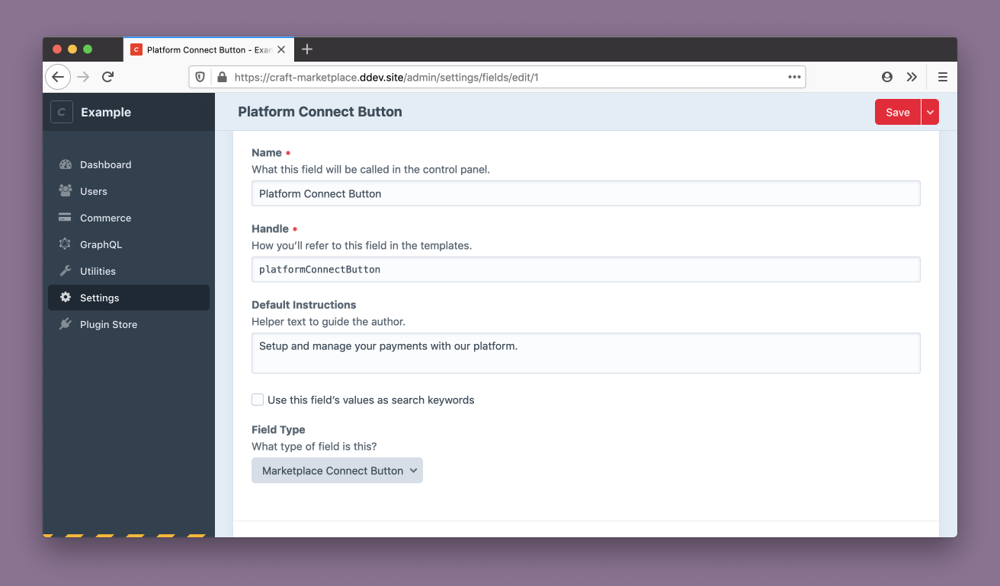
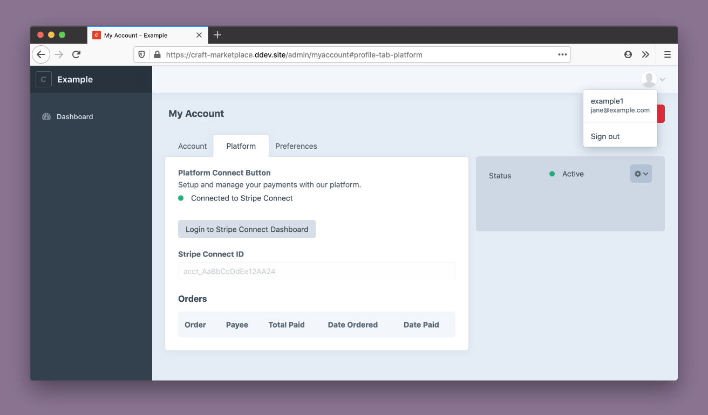
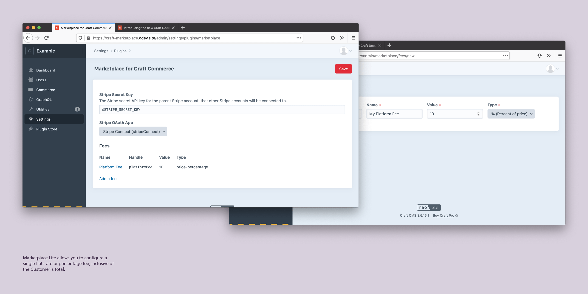
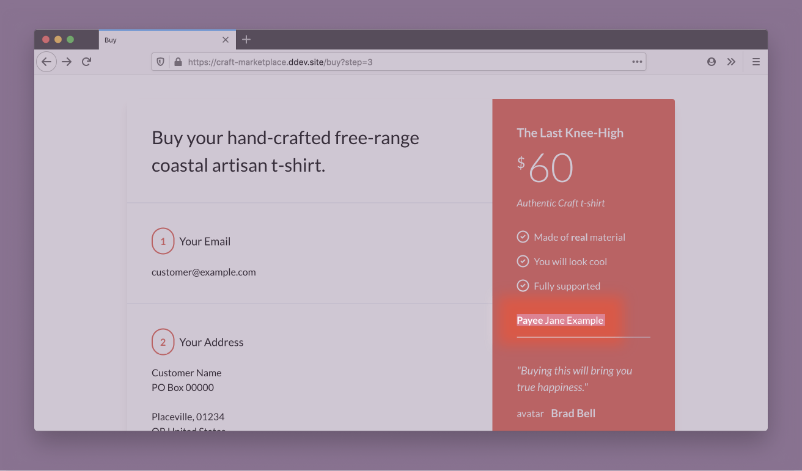

<a href="https://plugins.craftcms.com/marketplace" target="_blank"></a>

# Marketplace for Craft Commerce

Make your Craft ecommerce site into a Marketplace: add payees to products, charge a fee for your platform, and handle payouts automatically via Stripe Connect.

[Marketplace Lite for Craft Commerce Lite now available!](https://plugins.craftcms.com/marketplace)

## Features

- For Craft Commerce Lite
- For Stripe Payment Gateway
- Set Users as Payees on Products
- Charge a flat or percent Fee
- Automatically split payments

# Documentation

1. [Install](#install)
2. [Configure](#configure)
    - [Create a Stripe Connect app](#create-a-stripe-connect-app)
    - [OAuth 2.0 Client](#oauth-20-client)
    - [Redirect from Stripe to Craft CMS](#redirect-from-stripe-to-craft-cms)
    - [Configure Marketplace for Craft Commerce](#configure-marketplace-for-craft-commerce)
3. [Add Marketplace fields](#add-marketplace-fields)
4. [General use](#general-use)
    - [Add a new user](#add-a-new-user)
    - [Add the User as a Payee on a Product](#add-the-user-as-a-payee-on-a-product)
    - [Add a Fee for your platform](#add-a-fee-for-your-platform)
    - [Customize the Buy Template](#customize-the-buy-template)
5. [Advanced use](#advanced-use)
    - [Events](#events)
    - [Craft Commerce Pro](#craft-commerce-pro)

<!-- Maybe move those two sections as Further Reading that we link to instead?

6. Further Reading
  - Creating a Stripe Connect app (either in more detail, so we can skip over that in the intro, or advanced settings like the design assets)
  - Stripe Connect vs. Stripe Connect Express

-->

## Install

To use Marketplace, you will need:

- a [Stripe](https://stripe.com/) account
- the [Craft Commerce](https://plugins.craftcms.com/commerce) plugin installed in Craft CMS
- the [Stripe for Craft Commerce](https://plugins.craftcms.com/commerce-stripe) payment gateway installed in Craft CMS

To start, install:

- the [Marketplace for Craft Commerce](https://plugins.craftcms.com/marketplace) plugin
- the [OAuth 2.0 Client](https://plugins.craftcms.com/oauthclient) plugin



You can install the plugins through the Craft CMS dashboard, or using the command line:

```sh
# Require Marketplace plugin
composer require kennethormandy/craft-marketplace

# Install OAuth Client plugin
./craft install/plugin oauthclient

# Install Marketplace plugin
./craft install/plugin marketplace
```

## Configure

If you haven’t already, you’ll also need to create a new Stripe Connect application while in Test mode in your Stripe Dashboard.

### Create a Stripe Connect app

<!--


-->

<!-- TODO Add basic instructions for getting your Stripe Connect key from the Stripe Dashboard -->

When you are ready to go to production, you’ll need to do this again with your Stripe Dashboard set to Live mode.

Now, you can configure the OAuth Client plugin to use with your new Stripe Connect settings.

### OAuth 2.0 Client

Register a new OAuth App:



<table>
<thead>
<tr><th>Field</th><th>Value</th><th>Notes</th></tr>
</thead>
<tbody>
<tr><td>Name</td><td>Stripe Connect</td><td>…or whatever name you’d like</td></tr>
<tr><td>Handle</td><td><code>stripeConnect</code></td><td>…or whatever name you’d like</td></tr>
<tr><td>Provider</td><td>Stripe Connect Express</td><td></td></tr>
<tr><td>Client ID</td><td>Ex. <code>ca_AaBbCc…</code></td><td>Your Stripe Connect Client ID, from the Stripe Connect settings in the Stripe Dashboard.</td></tr>
<tr><td>Client Secret</td><td>Ex. <code>sk_AaBbCc…</code> or <code>sk_test_AaBbCc…</code></td><td>Your regular Stripe Secret Key from the Stripe Dashboard.</td></tr>
</tbody>
</table>

You’ll probably want to make your Stripe Connect Client ID and your Stripe Secret Key into [environment variables](https://craftcms.com/docs/3.x/config/#environmental-configuration). Then, you can easily switch from [Stripe Test keys to Live keys](https://stripe.com/docs/keys#test-live-modes), depending on the environment.

### Redirect from Stripe to Craft CMS

After saving your OAuth App, copy the Redirect URI from the “Setup Info.” You’ll want to add this to your Stripe Connect settings in the Stripe Dashboard. At the time of writing, this is stored in the Stripe Dashboard under: Settings → Connect settings → Integration.



Now, Stripe will be able to redirect sellers on your platform back to Craft CMS after saving their Stripe details.

### Configure Marketplace for Craft Commerce

Now that your OAuth App has been created, you can select it as the app to use, in the Marketplace for Craft Commerce settings. You’ll also need to fill in your Stripe Secret Key here too.



You can also set up a Fee now, or leave it blank. This is described later in [Add a Fee](#add-a-fee)


## Add Marketplace fields

Marketplace contains two new fields for you to use:

- **Marketplace Payee**, which makes it possible to specify the primary Payee on a given Craft Commerce Product.
- **Marketplace Connect Button**, gives users a button to connect and review their payout details

You’ll want to create a new Marketplace Payee field, and add it as a new field on the relevant Product Types.



For example, using the Clothing products that come with a fresh Craft Commerce install, you’d add the field to Commerce → System Settings → Product Types → Clothing → Product Fields:



<!-- TODO Had  a better screenshot for this, of modifying the Commerce Product fields. -->

You’ll also want to create a new Marketplace Connect Button field, and add it as a new field for Users. For example:




## General use

<!-- This is a bad title -->

At this point, everything necessary has been configured. The following example will use the default Craft Commerce products to finish setting up the site with Payees, a fee that the Platform charges, and some optional modifications to the default Craft Commerce Twig templates.

### Add a new user

- Add a new user
- Give that user permissions to login to Craft, and to auth with your new Stripe Connect OAuth app

<!-- There is a screenshot for this, but listing permissions is maybe more useful anyway -->

Minimum necessary permissions:

- **General** Access the control panel
- **OAuth Client** Login to Apps
- **OAuth Client** Login to Apps: Login to “Stripe Connect” app (or whatever you called your Stripe Connect app)

Login as that user (When you connect accounts, right now the associated token is always based on the logged in user account, rather than the profile of the person you are looking at. ie. you have to “Login as user” to test connecting their account, and you shouldn’t be able to see this field (or it should be disabled) unless you are looking at your own profile).



- Connect a new account, using Stripe Connect Express
- You should be redirected back to your own Craft CMS application, per [Redirect from Stripe to Craft CMS](#redirect-from-stripe-to-craft-cms).

### Add the User as a Payee on a Product

Let’s imagine this new user makes one of the Clothing Product we have on our store, and we want them to be paid for it. Now, we can go to that Product, and set them as the Payee:


### Add a Fee for your platform



Marketplace Lite allows you to configure a single flat-rate or percentage fee, inclusive of the customer’s total.

### Customize the Buy Template

Everything is configured! If you have filled in some content and have:

- The Stripe Payment Gateway in Test mode
- At least one Craft CMS User connected using Stripe, and
- At least one Commerce Product with that user set as a Payee

…you can run through test purchases and see the results in your Stripe dashboard.

Your Craft Commerce templates don’t _require_ any modifications to handle this, but depending on the kind of store or marketplace your are running, you might decide to make some. For example, you might show the Payee to the end cusomter. Imagine “Jane Example” designed “The Last Knee-High” product that comes pre-filled on Craft Commerce, and you want to show them in the default Craft Commerce buy templates:



The templates stored in `example-templates` in this repository are the minimum changes to use Marketplace with a default Craft Commerce install. The template changes are only to switch from using the Dummy Payment Gateway, from the default install, to Stripe, and to show the customer who the Payee is, which is optional.

As long as you’re using the Stripe Payment Gateway already, none of these changes are required to use Marketplace.

## Advanced use

### Events

- `kennethormandy\marketplace\services\Accounts`
  - `Accounts::EVENT_BEFORE_ACCOUNT_ACCESS`
  - `Accounts::EVENT_AFTER_CALCULATE_FEES_AMOUNT`
- `kennethormandy\marketplace\services\Fees`
  - `Fees::EVENT_BEFORE_CALCULATE_FEES_AMOUNT`
  - `Fees::EVENT_AFTER_CALCULATE_FEES_AMOUNT`
- `kennethormandy\marketplace\services\Payees`
  - `Payees::EVENT_BEFORE_DETERMINE_PAYEE`
  - `Payees::EVENT_AFTER_DETERMINE_PAYEE`

```php
use Craft;
use yii\base\Event;
use kennethormandy\marketplace\services\Payees;

// …

Event::on(
    Payees::class,
    Payees::EVENT_AFTER_DETERMINE_PAYEE,
    function (Event $event) {
        $lineItem = $event->lineItem;

        // Ex. Manually override the Stripe Account ID, based on
        // a specific case for your marketplace
        $event->gatewayAccountId = "acct_abc123";

        Craft::info("Handle EVENT_AFTER_DETERMINE_PAYEE event here", __METHOD__);
    }
);
```

### Craft Commerce Pro

Marketplace Lite pairs with Craft Commerce Lite’s single line item orders. If you are using Craft Commerce Pro, and your user interface limits customers to single line item orders (ex. a “Buy now” button with no cart), it will work equally well for you.

Marketplace Lite also includes support for Craft Commerce Pro and orders with multiple line items, when all line items have the same payee.

<!-- TODO Twig demo of what this might look like -->

If you’re interested in more comprehensive payment splitting for items in carts, Marketplace Pro will pair with Craft Commerce Pro, and is in stable beta. Feel free to [send me an email](mailto:hello+marketplace@kennethormandy.com) if you’re interested in previewing it for your project. It can be installed immediately.

<!-- TODO Not sure whether I’ll include this yet or not

## Stripe Connect versus Stripe Connect Express

Choose either “Stripe Connect” or “Stripe Connect Express” from the dropdown. They will be available in the dropdown as long as you’ve installed the Marketplace plugin too.
  - If the customer’s transaction appears to be directly with the payee, and the payee is transparently responsible for refunds and support, you will probably want to use “Stripe Connect”
  - If the customer’s transaction is with the platform, and would expect to come to the platform for refunds and support, you will probably want to use “Stripe Connect Express”
  - This is my own quick summary. To make your choice, follow Stripe’s extensive documentation and comparison chart: https://stripe.com/docs/connect/accounts
  - This is inconvenient to change once you’ve started connecting real accounts in live mode, but easy enough to change while in development

-->

<!--

# Promo image captions

Add Marketplace Buttons to User profiles, so Users or User Groups that you want to be paid out by your platform can up their payment information. This is managed by Stripe Connect Express, and facilitated for you by the Marketplace plugin.

Users who you want to become Payees will be walked through the Stripe on boarding process, when the click the connection button. Once their account is authorized, this will show in their Craft CMS profile, and in your Stripe Dashboard.

Here, a User has connected their account with Stripe, and you’ve indicated they should be paid for a $10 Craft Commerce product, with your platform taking a $1.23 fee (incl. Stripe’s standard fee you’d pay on any transaction).

Once a User has successfully set up their connection to your platform via Stripe, they will be able to open a minimal Stripe Dashboard to revise their account information, see their payout schedule, etc.

Marketplace gives you another new field to set Payees on Craft Commerce Products (and Digital Products). Indicate that a certain User should be paid out when a Customer purchases that Product.

Configure flat-rate or percentage fees for your platform to make, out of the transaction total.

If it makes sense for your platform, optionally display Payee information to your Customers. There is a full demo of setting this entire flow up with the default Craft Commerce Lite template included in the Marketplace documentation. The only code necessary is if you want to modify your Twig templates.

-->
