import RequirementsPartial from '../_shared/requirements.md'

# Build a marketplace using Craft&nbsp;CMS

This guide will walk you through creating an example, coffee-themed marketplace that sells coffees from multiple roaster businesses. 

It’s built using:

- [Craft CMS](https://craftcms.com/docs/4.x/)
- [Craft Commerce](https://craftcms.com/docs/commerce/4.x/)
- [Stripe for Craft Commerce](https://github.com/craftcms/commerce-stripe/tree/4.x/#readme), and
- Marketplace

…using a fresh install of Craft.

End customers will be able to buy coffee from multiple rosters at once.

Roasters will receive their portions of split payments automatically, and your platform will keep a specified fee. They will also be able to create and edit products, get paid, and view and manage their financial details, without manual work from you.

At the end of the tutorial, you’ll have a better understanding of how you can use and customize Marketplace and Stripe for your own comprehensive marketplace.

## Requirements

This guide assumes you and are also running [DDEV](https://ddev.readthedocs.io/en/stable/) for local development, just like in [Craft’s quick start](https://craftcms.com/docs/4.x/install.html#quick-start) and more comprehensive [getting started tutorial](https://craftcms.com/docs/getting-started-tutorial/).

If you are *not* using DDEV, all the console commands in this tutorial are still relevant, but don’t need to be prefixed with `ddev`.

With your fresh install of Craft ready, install the aforementioned plugins. You can do this via the Plugin Store within the Craft control panel, or using the command line.

<RequirementsPartial />

## Setup Craft Commerce

Craft Commerce does not need much configuration at this stage of the project.

All your project needs is:

- a product type, so new products can be added
- the Stripe payment gateway, so customers can checkout

Other features of Commerce like shipping, taxes, etc. can all be configured later, depending on how you want to run your marketplace.

### Create a product type

Make a new “Coffee” product type under **Commerce → System Settings → Product Types**.

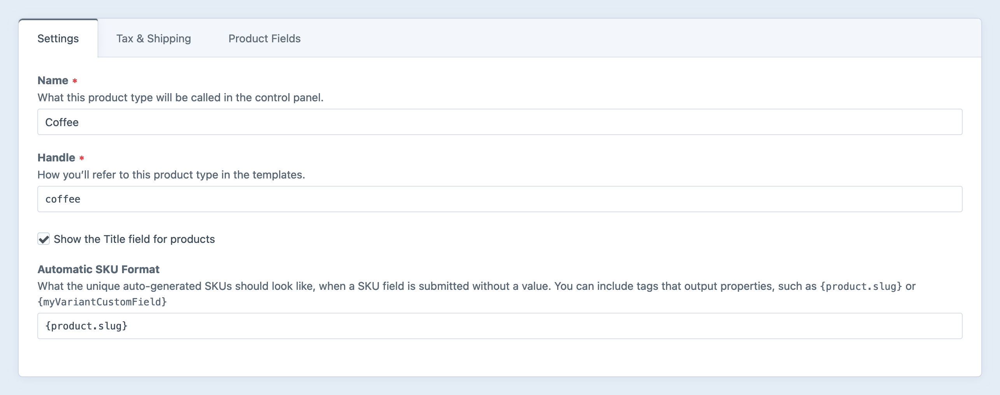

For now, you can set the Automatic SKU Format to:

```twig
{product.slug}
```

…or leave it blank. We’ll customize it later in the tutorial.

### Create a product

Now, it’s possible to add new products under **Commerce → Products**.

Let’s add medium roast coffee available for purchase:

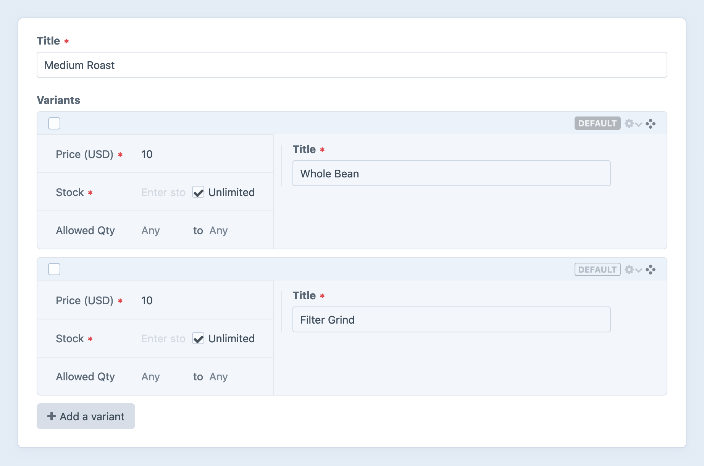

I’ve created two variants: a whole bean option, for people who want to grind the coffee themselves, and a pre-ground option. 

Create one or two more coffee products—just enough to give us something to work with for now.

### Create a payment gateway

Now, you’re ready to add the Stripe payment gateway, so customers will actually be able to checkout and pay.

As described in the [Stripe for Craft Commerce gateway README](https://github.com/craftcms/commerce-stripe/tree/4.x?tab=readme-ov-file#setup):

>  …open the Craft control panel, navigate to **Commerce** → **System Settings** → **Gateways**, and click **+ New gateway**.
> 
> Your gateway’s **Name** should make sense to administrators _and_ customers (especially if you’re using the example templates).
> 
> ### Secrets
> 
> From the **Gateway** dropdown, select **Stripe**, then provide the following information:
> 
> - Publishable API Key
> - Secret API Key
> - Webhook Signing Secret (See [Webhooks](#webhooks) for details)
> 
> Your **Publishable API Key** and **Secret API Key** can be found in (or generated from) your Stripe dashboard, within the **Developers** &rarr; **API Keys** tab. Read more about [Stripe API keys](https://stripe.com/docs/keys).
> 
> :::note
> 
> To prevent secrets leaking into project config, put them in your `.env` file, then use the special [environment variable syntax](https://craftcms.com/docs/4.x/config/#control-panel-settings) in the gateway settings.
>
> :::
> 
> Stripe provides different keys for testing—use those until you are ready to launch, then replace the testing keys in the live server’s `.env` file.

### Use the example templates

Craft Commerce comes with [full-featured example templates](https://craftcms.com/docs/commerce/4.x/example-templates.html). We’re going to use these for the user-facing portion of our Marketplace in this tutorial. Copy the templates into your project with the following console command:

```sh
commerce/example-templates --folder-name shop
```

You should now have the templates in the `templates/shop`.

Now you can visit the front-end of the site, and see a typical Craft Commerce install is ready at `/shop`:

```sh
# Open /shop in your default browser
ddev launch shop
```

You should see something like this in the browser:

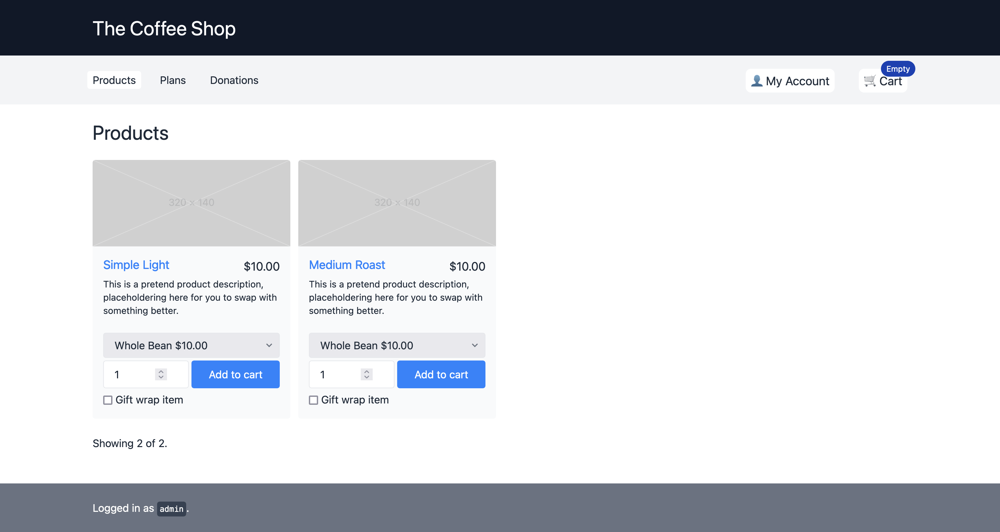

Run through a test order, and make sure you can see that the payment has gone through within Stripe. If you can see it, then your Commerce site is setup correctly, and you’re ready to move onto the next step.

## Content Modelling

So far, our Craft Commerce site only supports us selling our own products. We want to support multiple vendors, so we need to make some edits to our [content model](https://craftcms.com/docs/getting-started-tutorial/configure/) to do this.

### Create the connection field

First, create a new Marketplace Connect Button field, provided by the Marketplace plugin.

It will represent the connection between Stripe and Craft. For our coffee marketplace, we’ll label it “Platform Connection.”

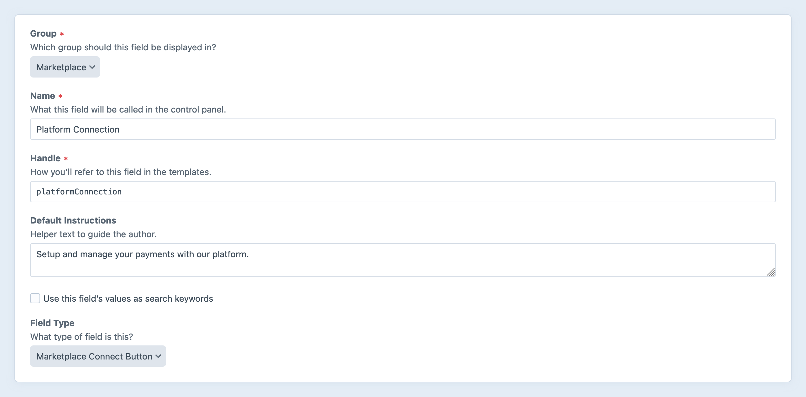

### Create a section for vendors

<!-- Decide on a term: Payee, Connected Accounts, Sellers, Vendors. Or use Roasters for the sake of the tutorial. -->

Your marketplace will need to onboard vendors. In Craft, these vendor organizations will either be represented by [users](https://craftcms.com/docs/4.x/reference/element-types/users) or by [entries](https://craftcms.com/docs/4.x/reference/element-types/entries).

Like Craft, Marketplace leaves it up to you how to model content for your marketplace, but it’s almost always better to choose entries.

This will allow multiple users login to and be associated with a single vendor—even if you don’t need that feature in the short term.

For our coffee marketplace, create a new section called “Roasters.”

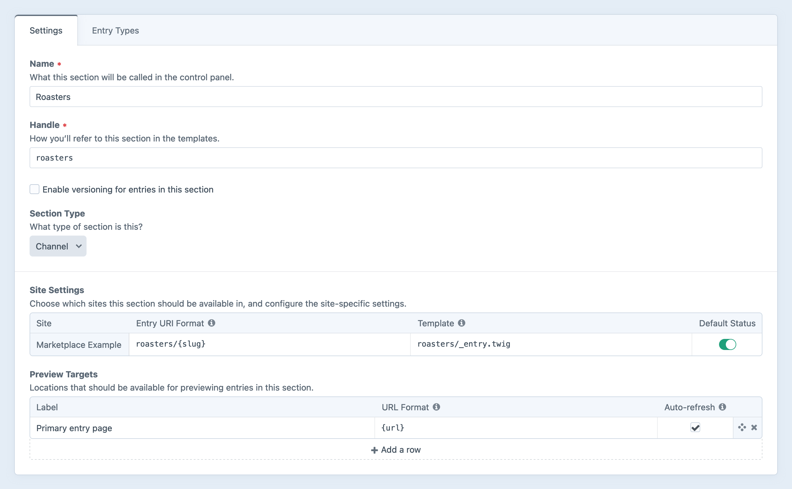

Update the entry type name from “Default” to “Roaster,” and add the new “Platform Connection” field to its field layout.

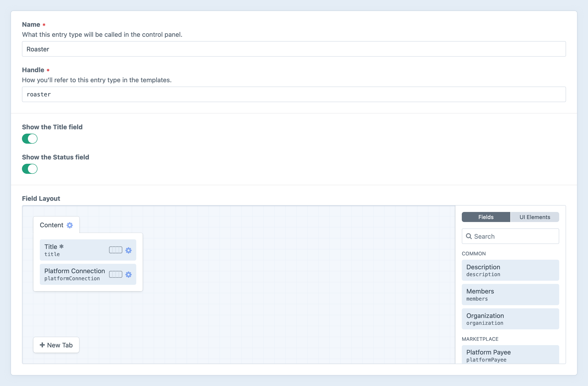

As with the coffee products, you can now create a few example entries as content to work with.

### Create an entries field

We’re also going to need an entries field, so we can relate these Roaster entries to other things in Craft:

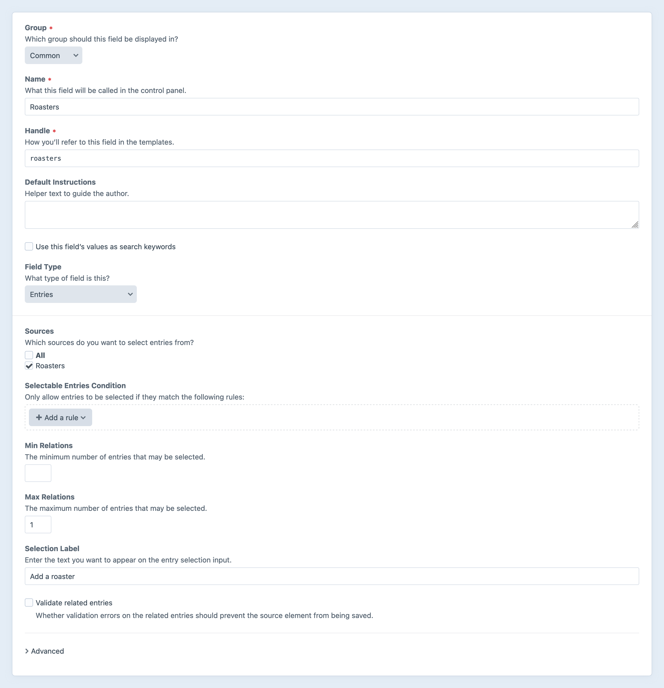

### Update the Coffee product type and products

Now, we have a few roasters and a few coffees (manually) filled in on our marketplace—but nothing has changed on the front-end for end customers. There is still no way to see a specific coffee is coming from a specific roaster. Let’s change that!

Go back to **Commerce** → **System Settings** → **Product Types** → **Coffee** → **Product Fields**, to edit your existing Coffee product type. Add the new Roaster field:

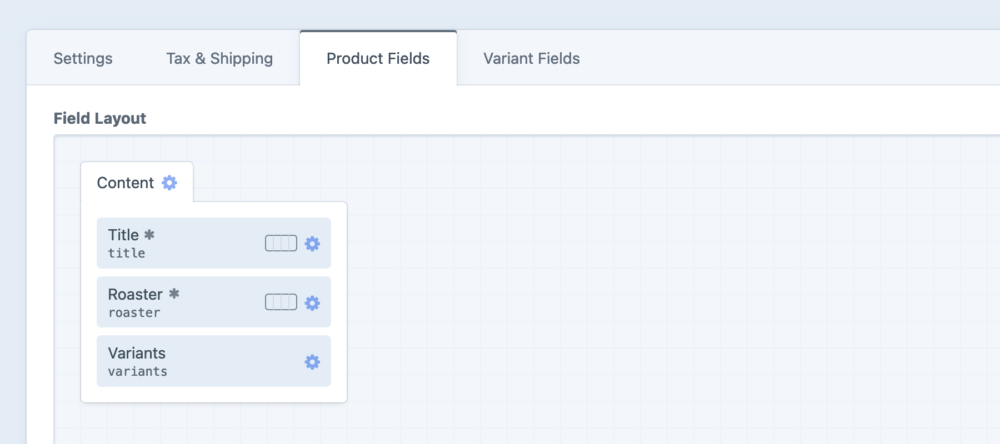

This will make it possible for you to select which product is from which roaster.

This is just Craft, so you can also add any other fields that you like at this stage, like a product image or description.

At this stage, we’re going to fill in some content manually within the Craft control panel. Once your admin area is completely build out, it wouldn’t be *you* as filling this in, but vendors, as the create products in your custom admin area.

If you have, say, three example coffees and three example roasters, let’s edit each coffee to make it from a different roaster:

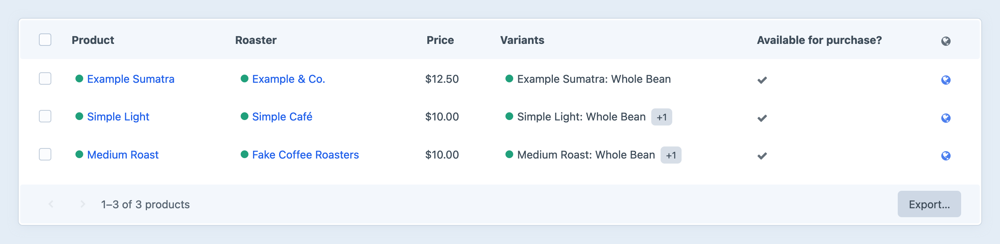

### Create a user group

In the next section, we’re also going to start onboarding example users. We also need to know which users work for roasters (as opposed to being end customers), and specifically what roaster they work for.

First, go to **Settings** → **Users** → **User Groups**, and add your first user group called “Roaster Team Members”.

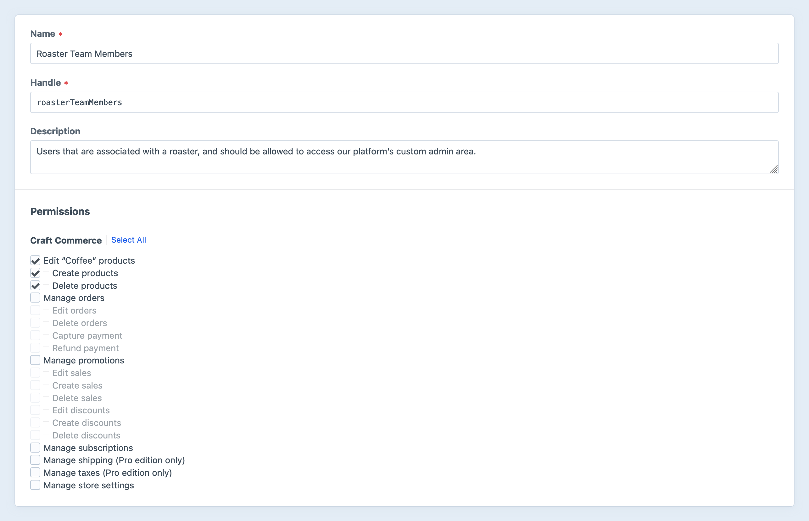

For now, anyone in this group should have permissions to Edit, Create, and Delete “Coffee” products.

### Edit the user field layout

Under **User Fields**, you’ll be able to add the Roaster field to the user field layout. This will let you relate users to a roaster, in the same way you related a product to a roaster.

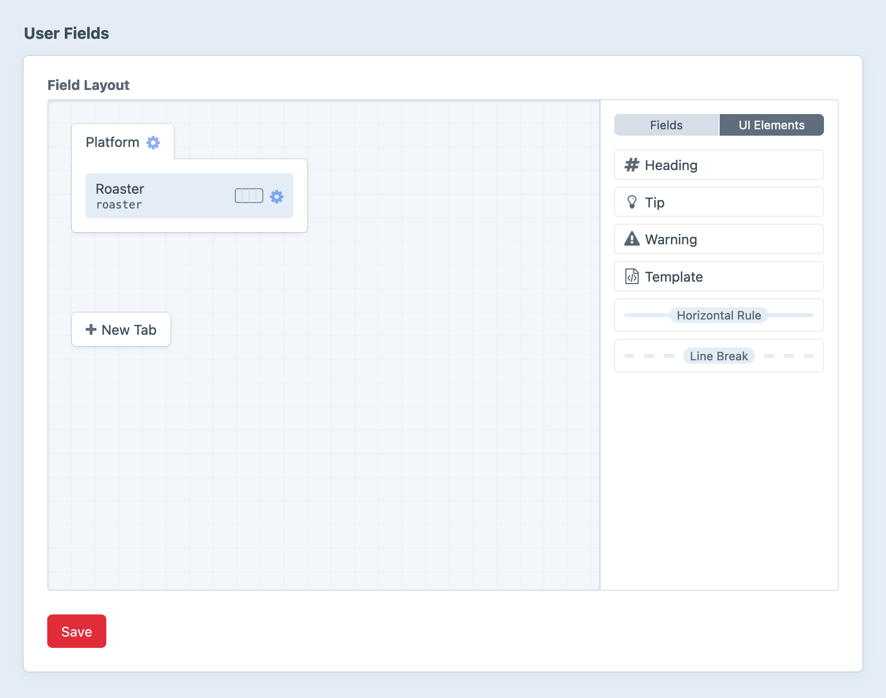

If you’d like, you can take this a step further and user Craft’s [conditional fields](https://craftquest.io/courses/whats-new-in-craft-cms-4/40475) so that this Roaster field is only visible on a user when they are in the Roaster Team Member user group.

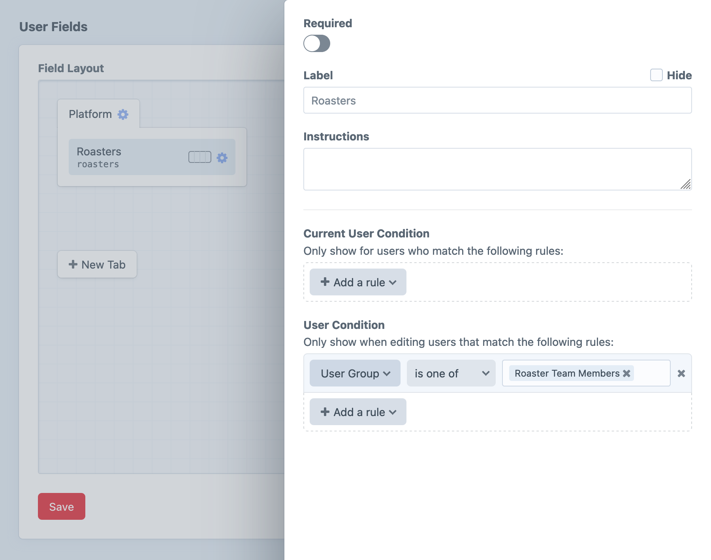

Create another example user or two for us to work with, put them in the Roaster Team Members user group, and relate each one to a different roaster.

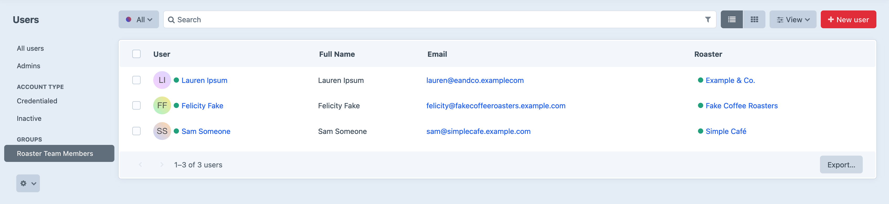

You’ll impersonate one of these users in the next section, as if you were onboarding their coffee company onto the marketplace.

## Setup Marketplace

You now have content filled in for a few roasters, and the roasters have a user on the team, and a coffee available for sale.

Now, we’ll start making use of the Marketplace plugin to bring this all together into something functional.

Navigate to **Settings** → **Plugins** → **Marketplace**, add in your secret key from Stripe.

Here, you can also set a global fee for your platform. In this example, we’re going to keep a 10% fee for all sales on the platform, so fill in `0.10`:

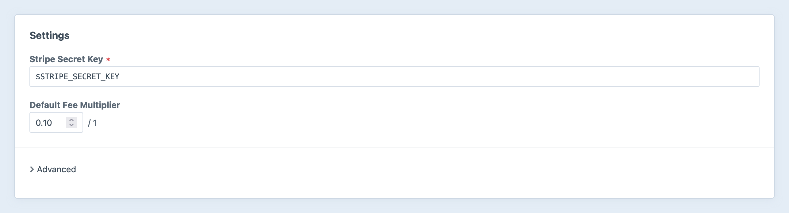

Instead of using a global fee, you can entirely customize this fee based on the product, vendor, price, etc. using [events](./events/fees-event). This global setting is here for the most basic use case, where you have a single percentage fee for the entire platform, with no exceptions. That’s what we’re going to use it for in our example coffee marketplace.

### Create a custom dashboard area

Now, you’re ready to onboard your first roaster to your marketplace.

We need an area where roaster employees can login to the platform, and have a simplified interface to only manage the things we want them to manage—namely, their roaster details (ex. description, logo), the basic details of their products, and access their Stripe dashboard.

They don’t need full access to the Craft control panel to do this—and you probably wouldn’t want them to have it regardless.

To facilitate this, we are effectively implementing a version of the official [Front-End User Accounts](https://craftcms.com/knowledge-base/front-end-user-accounts) guide.

However, this area will *only* be for roasters. We already have a default account area (via the Commerce example templates) where *customers* can edit their profile, see their past orders, etc. Now, we need an account area for roasters that are selling the coffee.

We’ll call this area the Roaster Admin. Create a very basic new layout for it in `templates/roaster-admin/_layout.twig`:

```twig title="templates/roaster-admin/_layout.twig"
<!DOCTYPE html>
<html lang="en">
<head>
  <meta charset="UTF-8">
  <meta name="viewport" content="width=device-width, initial-scale=1.0">
  <title>{{ title ?? 'Roaster Admin' }}</title>

	{#
	  Pico CSS is not required, but gives us some basic
    styling without markup changes for our demo.
  #}
  <link href="https://cdn.jsdelivr.net/npm/@picocss/pico@2.0.6/css/pico.classless.blue.min.css " rel="stylesheet">
</head>
<body>
  <main>
    
    
  </main>
</body>
</html>
```

Create a new template in `templates/roaster-admin/login.twig`:

```twig title="templates/roaster-admin/login.twig"




  <h1>Login</h1>

  <form method="post" accept-charset="UTF-8">
    {{ csrfInput() }}
    {{ actionInput('users/login') }}

    {# Redirect users to the vendor admin area #}
    {{ redirectInput( '/roaster-admin' ) }}

    <label>
      <div>Email</div>
      {{ input('email', 'loginName', '') }}
    </label>

    <label>
      <div>Password</div>
      {{ input('password', 'password', '') }}
    </label>

    <button>Login</button>

    
      <p>{{ errorMessage }}</p>
    
  </form>


```

You can also create `templates/roaster-admin/index.twig`, to give them something to see once they login:

```twig title="templates/roaster-admin/index.twig"




  {# Query the product type by its handle #}
  

  {# Require the user to login #}
  

  {# Require permission to create coffee products (sufficient for our purposes for now) #}
  

  {# Query the roaster the user is part of #}
  

  <h1>Hello {{ currentUser.fullName ?? 'there' }}!</h1>

  

    <p>Please ask the marketplace owner to associate your account with a roaster.</p>

  

    <p>Welcome to the {{ roaster.title ?? 'roaster' }} dashboard.</p>

    {# Render a button to connect the roaster to Stripe Connect, via Marketplace #}
    {{ craft.marketplace.renderConnector(roaster) }}

  


```

This is described in more detail in Craft’s [User Management](https://craftcms.com/docs/4.x/user-management.html#checking-permissions) documentation. For our purposes, it’s sufficient for creating a login form that will work for our roaster employee users, but is not for customers.

### Impersonate a user

Now, we need to add some new users (besides us) that can actually go and use the roaster admin.

For the sake of our example, let’s say we are early on in our marketplace’s life, and we are going to manually create and approve every roaster and every user within it—we aren’t offering public registration yet.

Go to one of the new, fake users you created, and impersonate their account:

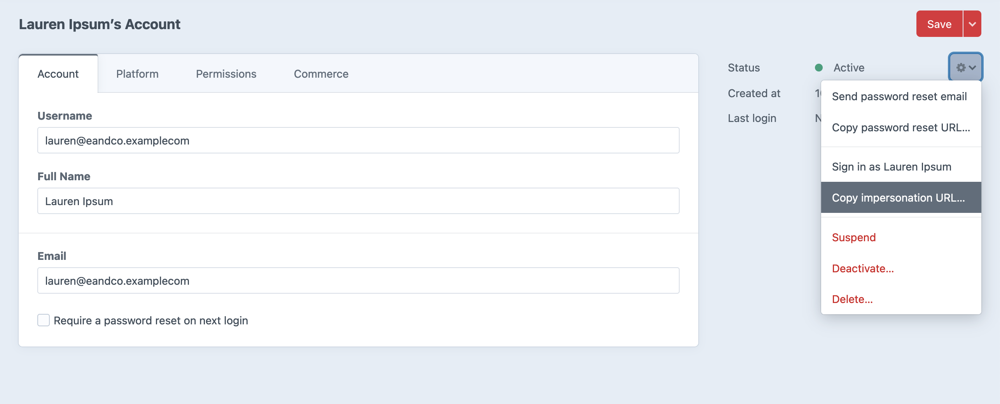

### Connect to Stripe

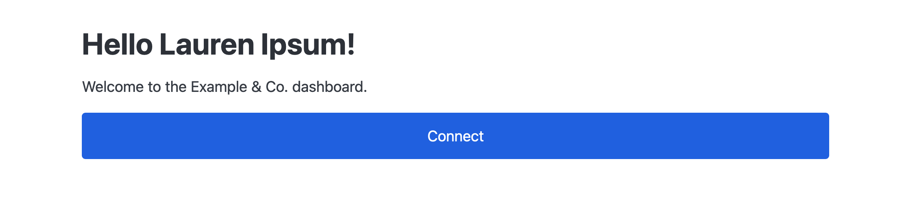

In this template, we also query the roaster related to the user. With that, we can render a connection button so you can connect the Roaster to Stripe.

Clicking it will initiate the Stripe-hosted onboarding flow:

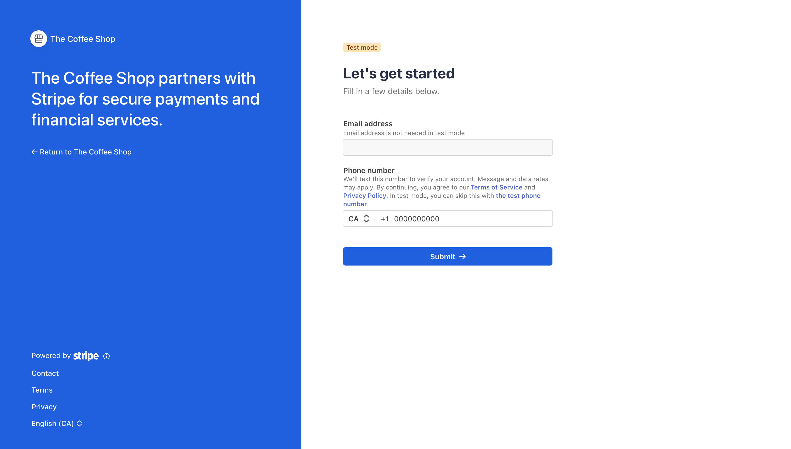

Run through this, accepting Stripe’s prompts for pre-filling fake information in test mode. Once you’re done, you’ll be sent back to your platform.

## Template

The marketplace is ready to use, but customers aren’t going to easily be able to tell which roaster sells which coffee. Let’s make a few small changes to the example templates, to make that more obvious.

In the Cart, you might show the roaster name as part of the line item:

```twig title="templates/shop/cart/index.twig"
{# Query the roaster associated with the product #}



  <div class="mb-1 text-xs">{{ roaster.title }}</div>

```

Giving you something like this:

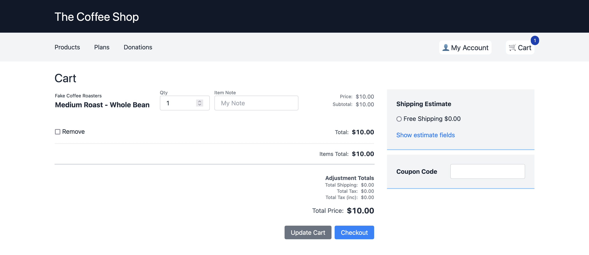

Similarly, you might want to show the roaster name in the product grid and product detail page, too:

```twig title="templates/shop/products/_product.twig"
<!-- highlight-next-line -->


<div class="text-sm w-2/3">
  <!-- highlight-next-line -->
  {{ roaster.title|default('') }}
</div>
<div class="relative text-lg text-bold mb-2 flex items-baseline leading-tight">
  <div class="w-2/3">
    <a class=" text-blue-500 hover:text-blue-600" href="{{ product.url }}">
      {{ product.title|title }}
    </a>
  </div>
  <div class="w-1/3 text-right">
    <span>{{ product.defaultPriceAsCurrency }}</span>
  </div>
</div>
<p class="text-sm">
  {{ product.description|default('This is a pretend product description, placeholdering here for you to swap with something better.')|t }}
</p>
```

```twig title="templates/shop/products/_includes/grid.twig"
<!-- highlight-next-line -->


<div class="text-sm w-2/3">
  <!-- highlight-next-line -->
  {{ roaster.title|default('') }}
</div>
<div class="relative text-lg text-bold mb-2 flex items-baseline leading-tight">
  <div class="w-2/3">
    <a class=" text-blue-500 hover:text-blue-600" href="{{ product.url }}">
      {{ product.title|title }}
    </a>
  </div>
  <div class="w-1/3 text-right">
    <span>{{ product.defaultPriceAsCurrency }}</span>
  </div>
</div>
<p class="text-sm">
  {{ product.description|default('This is a pretend product description, placeholdering here for you to swap with something better.')|t }}
</p>
```

I’ve made a few other small changes to distinguish coffees: a description field, to override the placeholder description, and a colour field to give each different roaster a Tailwind colour class to use.

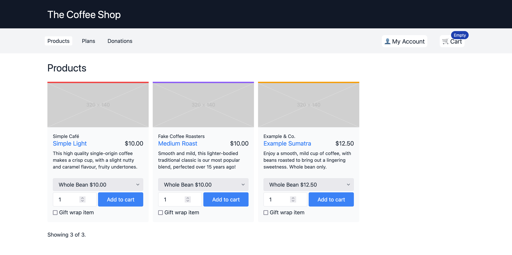

## Checkout

Now, you have at least two different roasters onboarded, each with a different coffee. Customers can tell which roaster we are purchasing different coffees from—but can still add whichever ones they want to our cart.

If we were to checkout with both products in our cart, we’d expect the end customer would pay once for the total, we’d keep a 10% fee, and each roaster would get their remaining portion of the money—all without any manual payout management from us.

In a new private browsing window, so you aren’t already logged into Craft, visit the site, add at least two products to your cart, and checkout.

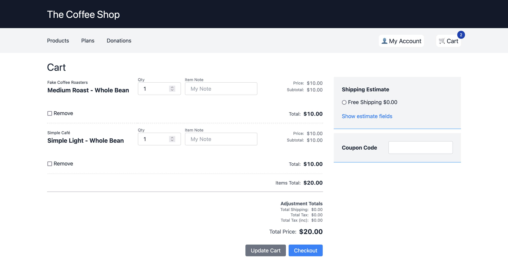

The example templates allow you to skip filling in the shipping portion of the order, by using the step headings. You can skip ahead to payment.

Choose the Stripe gateway, and complete payment using [the Stripe test card number](https://docs.stripe.com/testing#cards):

```
4242 4242 4242 4242
```

You can fill in any valid date and <abbr title="Card Verification Code">CVC</abbr>.

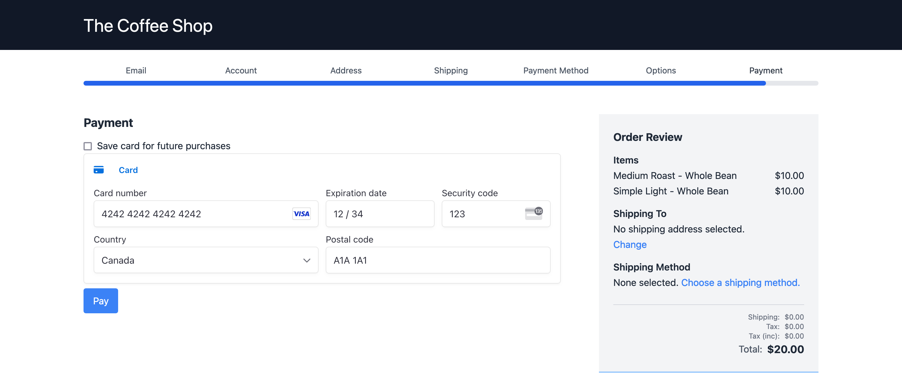

You have successfully made a purchase from your new marketplace!

### Review the transaction on Stripe

Your stint pretending to the be the customer is over—you can now return to your marketplace business-runner persona.

Let’s switch over to your platform’s Stripe dashboard, to see how this transaction appears.

You can see the payment went through on Stripe:

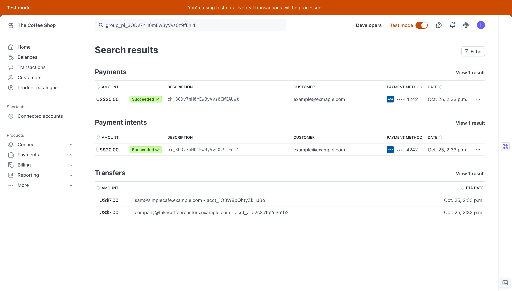

This transaction has the metadata that Commerce includes automatically, like the order ID and order number, making it easy to find the corresponding order in Craft Commerce.

It also includes <cite>transaction group</cite>, which indicates payment splitting has occurred.

At the time of writing, this ID isn’t a clickable link in the Stripe dashboard, but you can copy it and search it. This will take you to a different view showing all the details you need about this group of transactions:


Let’s check the payment splitting has occurred as we expect.

The original order was for one $10 coffee and one $12 coffee. The marketplace we’re building took a 10% fee on each of them. So the result should be:

<table>
<thead>
<tr>
<th>Payee</th>
<th>Amount</th>
</tr>
</thead>
<tbody>
<tr>
<td>Marketplace (via fee)</td><td>$2.20</td>
</tr>
<tr>
<td>Roaster 1</td><td>$9.00</td>
</tr>
<tr>
<td>Roaster 2</td><td>$10.80</td>
</tr>
</tbody>
<tfoot>
<tr>
<th>Total</th><td>$22.00</td>
</tr>
</tfoot>
</table>

We see that reflected in the Stripe results.

The Stripe account has kept $2.20, and a transfer has been made to one account for $9.00, and another account for $10.80. The `acct_` IDs that are referenced are the same ones you’ll see if you visit the entries for Roaster 1 and Roaster 2.

We can even go back and login as Roaster 1 again—imagining we want to check on our payouts ourselves—and login to our own Stripe Express dashboard. It will show us that we have one $9.00 payout pending.

<!--


-->

{/*

## What’s next

What’s next, ie. stuff that isn’t going to be in this tutorial

Maybe don’t even include product management yet? Or only the very most basic stuff?

For customers
- Add individual vendor pages, ex. `/roasters/example-roaster`, which lists all the products from a single roaster

For vendors
- Create and edit products
- Advanced handling of permissions, based on their roaster instead of technically being able to edit any entry
- Vendor user registration
	- Could allow public sign up by roasters, likely with a pending approval step
	- Once the roaster has successfully signed up, you could allow them to register new users within that
- Could do fixed product, multiple vendors. Ex. Maybe this marketplace only sells medium roasts, so you have a single medium roast product that every roaster can edit, and they don’t create new products.

For administrators

*/}
